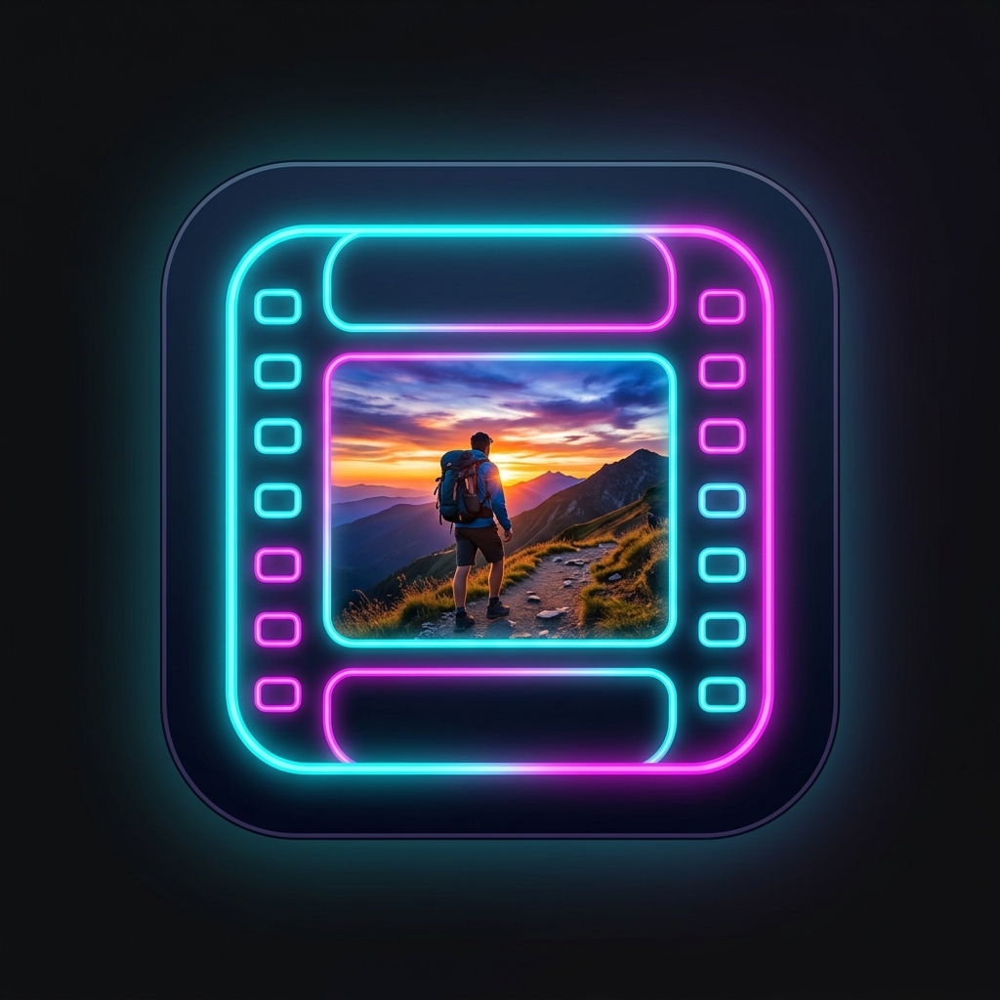

  

# Frame Extractor for Android

A high-performance Android utility built entirely in Jetpack Compose for frame-accurate video navigation and lossless image extraction. 

## Features
- **Zero-Dependency Core**: Written entirely in Kotlin and Jetpack Compose without requiring heavy external ML or Image Processing libraries. Custom SVG icons built directly into code.
- **Precision Navigation**: Provides standard media wheel controls to step forward and backward frame-by-frame with a custom dynamic FPS playback rate.
- **Pinch-to-Zoom Engine**: Full touch-screen support for panning and zooming deep into high-resolution videos without lag.
- **Lossless Extraction**: One-tap extraction to pull the exact raw Bitmap from the video stream and save it natively to your device's Pictures directory as a 100% quality PNG.

## Technologies Used
- **Kotlin**
- **Jetpack Compose** (Material 3)
- **MediaMetadataRetriever** (Native Android API)
- **Coroutines** (Background thread decoding)
